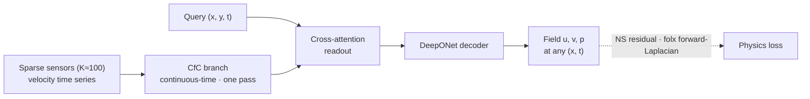

# PI-CON

**Physics-Informed Continuous-Time Operator for Sparse-Sensor Turbulent-Flow Reconstruction**

> Reconstruct continuous space–time velocity/pressure fields from ~100 fixed
> velocity sensors, trained on Navier–Stokes residuals + sensor readings **alone**
> — no full-field DNS supervision.

JAX/Flax implementation. Two cases are supported: forced isotropic turbulence
(Kolmogorov flow, periodic) and a cylinder wake (non-periodic, wall boundary
conditions).

## Approach

- **Sensor-only, DNS-free supervision** — the model learns from sparse velocity
  time series plus PDE residuals. Reference DNS/LES fields are used only to
  sample sensor locations and to evaluate, never as dense supervision.
- **Continuous in space and time** — a DeepONet decoder answers any query
  $(x, y, t)$ in the domain, so reconstruction is not tied to a grid or to the
  sensor sampling cadence.
- **Closed-form time propagation** — the branch encoder is a CfC (closed-form
  continuous-time) network, which consumes the sensor history in a single pass.
- **Collapsed forward-Laplacian** — the NS residual needs second derivatives of
  the decoder output; `folx` computes them in one forward pass instead of
  nesting reverse-mode AD, which is what makes the high-$Re$ runs affordable.



Implementation: [`pi_lnn_jax/models.py`](pi_lnn_jax/models.py) (architecture),
[`pi_lnn_jax/physics.py`](pi_lnn_jax/physics.py) (NS / Poisson residual),
[`pi_lnn_jax/autodiff.py`](pi_lnn_jax/autodiff.py) (field derivatives).

## Repository

| Path | Contents |
|---|---|
| [`pi_lnn_jax/`](pi_lnn_jax/) | Core — models, physics, autodiff, losses, config, checkpointing, evaluation |
| [`pi_lnn_jax/pipeline/`](pi_lnn_jax/pipeline/) | Per-case training chains (Kolmogorov / cylinder); start at each case's `__init__.py` |
| [`configs/`](configs/) | Experiment configs — see [`configs/README.md`](configs/README.md) |
| [`scripts/`](scripts/) | Evaluation, diagnostics, plotting, Slurm submission — see [`scripts/README.md`](scripts/README.md) |
| [`tests/`](tests/) | 126 test files |
| [`docs/adr/`](docs/adr/) | Architecture decision records |
| [`CONTEXT.md`](CONTEXT.md) | Domain vocabulary for evaluation artifacts and configuration |

Entry points are [`train_kolmogorov.py`](train_kolmogorov.py) and
[`train_cylinder.py`](train_cylinder.py); both are thin CLI wrappers over
`pi_lnn_jax/pipeline/`.

## Install & run

```bash
uv sync
```

This installs CPU JAX. GPU wheels are deliberately kept out of `uv.lock` so that
a plain `uv sync` stays portable; install them separately:

```bash
scripts/slurm/setup_gpu_venv.sh
```

Unit tests:

```bash
PYTHONPATH=. uv run python -m pytest tests/ -q
```

The suite is dominated by XLA compilation rather than computation. A persistent
compilation cache plus `pytest-xdist` cuts wall time by roughly 5×:

```bash
PYTHONPATH=. JAX_COMPILATION_CACHE_DIR=.jax_cache \
JAX_PERSISTENT_CACHE_MIN_COMPILE_TIME_SECS=0 \
JAX_PERSISTENT_CACHE_MIN_ENTRY_SIZE_BYTES=0 \
uv run python -m pytest tests/ -q -n 4 --dist loadfile
```

Both `MIN_*` variables matter: the default 1-second threshold keeps most graphs
out of the cache, and each xdist worker then recompiles them independently.

Training runs are submitted to Slurm:

```bash
scripts/slurm/submit_exp.sh EXP_ID CONFIG_PATH
DRY=1 scripts/slurm/submit_exp.sh EXP_ID CONFIG_PATH   # print the plan only
```

## Data

Sensor files for the Kolmogorov case are version-controlled under
[`data/`](data/). Full-field DNS and LES binaries (>100 MB) are not; they are
located at runtime via `PILNJAX_DATA_ROOT`. See [`.gitignore`](.gitignore) for
what is excluded and [`scripts/README.md`](scripts/README.md) for the generation
scripts.

## Notes on this repository

Source comments and docstrings refer to an internal knowledge base under
`knowledge/` and to manuscript sources under `paper/`. Neither is included here;
those references are retained as provenance for the decisions they document, and
are expected to be dangling.

Results are reported in an accompanying manuscript that is not part of this
repository.

## License

Apache License 2.0 — see [`LICENSE`](LICENSE).
